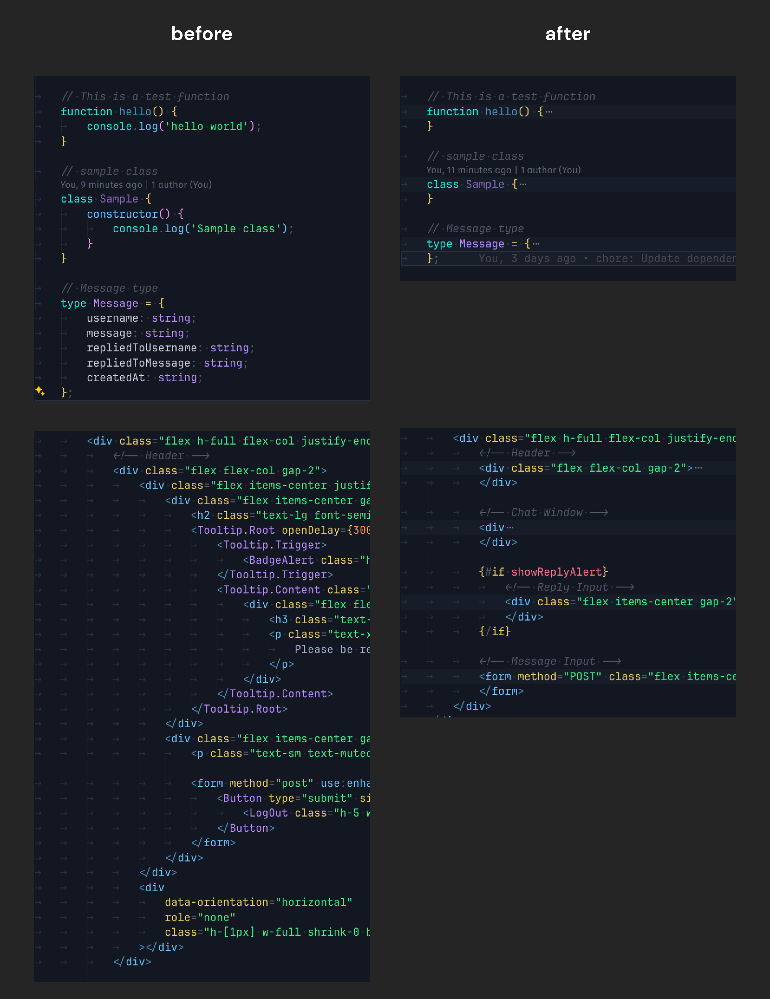

# TidyFold

TidyFold is a VS Code extension that provides smart folding for Svelte and web development files. It enhances the default folding behavior with customizable options specifically designed for Svelte components.

## Features

- Automatically folds specific regions in Svelte files
- Supports Svelte 5 runes ($state, $effect, $derived, etc.)
- Customizable folding behavior through extension settings
- Debug tools to understand what's being folded and why
- Visual highlighting of foldable blocks

## Extension Settings

TidyFold contributes the following settings:

- `tidyfold.enableCustomFolding`: Enable/disable custom folding behavior (default: true)
- `tidyfold.foldParentBlocks`: Enable folding of parent blocks like div and script tags (default: false)
- `tidyfold.excludedFoldingElements`: List of HTML elements that should not be folded (without angle brackets)
- `tidyfold.showDebugLogs`: Show debug logs in output channel when folding operations occur (default: false)
- `tidyfold.highlightFoldableBlocks`: Highlight foldable blocks with a light border (default: false)

## Keybindings

- **Fold All**: `Ctrl+Alt+]` (macOS: `Cmd+Alt+]`)
- **Unfold All**: `Ctrl+Alt+[` (macOS: `Cmd+Alt[`)

## Troubleshooting

If you encounter "command not found" errors:

1. Reload VS Code window with `Ctrl+Shift+P` > "Developer: Reload Window"
2. Try restarting VS Code completely
3. Check Output Panel (`Ctrl+Shift+U`) and select "TidyFold" from dropdown
4. Make sure you're running the latest version

## Screenshot

## Installation

1. **Install from the VS Code Marketplace**:

   - Open Visual Studio Code.
   - Go to the Extensions view by clicking on the Extensions icon in the Activity Bar on the side of the window.
   - Search for "TidyFold" and click "Install".

2. **Install from a VSIX file**:
   - Download the `.vsix` file for TidyFold.
   - In Visual Studio Code, open the Extensions view.
   - Click on the three dots at the top-right corner and select "Install from VSIX...".
   - Choose the downloaded `.vsix` file to install the extension.

## Usage

By default, TidyFold will prevent folding of `
` and `<script>` tags since these often contain other foldable elements, and VSCode's default behavior would fold everything inside them as well. If you prefer to include these elements in folding, you can set `tidyfold.foldParentBlocks` to `true`.

1. Open any code file in Visual Studio Code.
2. Run the TidyFold command:
   - Open the Command Palette (`Ctrl+Shift+P` or `Cmd+Shift+P` on macOS).
   - Type and select `TidyFold: Minimize Expanded Regions`.

The extension will automatically fold the targeted regions and scroll to the top of the document.

## Commands

TidyFold provides the following commands (available in the command palette with `Ctrl+Shift+P`):

- **TidyFold: Minimize Expanded Regions** - Collapses all foldable regions in the current file
- **TidyFold: Unfold Regions** - Expands all folded regions in the current file
- **TidyFold: Debug Folding Regions** - Shows which regions would be folded in the current file
- **TidyFold: Show Debug Logs** - Opens the debug log output panel to view detailed folding operations
- **TidyFold: Toggle Highlight Foldable Blocks** - Toggles visual highlighting of foldable blocks
- **TidyFold: Refresh Foldable Block Highlights** - Refreshes the highlights after file changes

## Highlighting Foldable Blocks

TidyFold can visually highlight regions that are eligible for folding. This makes it easier to understand which parts of your code will be affected by folding operations.

To use this feature:

1. Enable highlighting: Run the command `TidyFold: Toggle Highlight Foldable Blocks`
2. All foldable regions will be highlighted with a light border
3. Toggle the highlighting off using the same command

You can also permanently enable highlighting by setting `tidyfold.highlightFoldableBlocks` to `true` in your VS Code settings.

## Seeing Debug Logs

If you can't see logs:

1. Enable debug logging: Set `tidyfold.showDebugLogs` to `true` in your settings
2. Open the Debug Logs: Run the command `TidyFold: Show Debug Logs` from the command palette
3. Perform folding operations to see the logs appear in the output panel

## Contributing

Contributions are welcome! If you find a bug or have a feature request, please open an issue on the [GitHub repository](https://github.com/your-repo/tidyfold).

## License

This project is licensed under the MIT License. See the [LICENSE](LICENSE) file for details.

## Acknowledgments

This extension leverages the VS Code API to provide folding functionality. Special thanks to the VS Code team for their extensive documentation and support.

## Release Notes

### 1.2.0

- Added visual highlighting of foldable blocks
- Added commands to toggle and refresh highlighting

### 1.1.0

- Added new setting to control parent block folding behavior
- Improved handling of div and script tags

### 1.0.0

- Initial release
